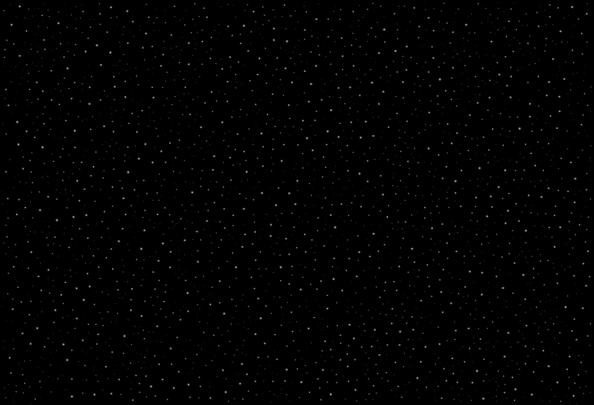
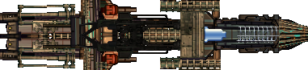

# Asteroid Game

¡Bienvenido al proyecto **Asteroid Game**! Este archivo README sirve como un manual completo para jugar, entender el código fuente, y contribuir al desarrollo de este proyecto.

---

## Tabla de Contenidos
1. [Descripción del Juego](#descripción-del-juego)
2. [Controles del Juego](#controles-del-juego)
3. [Instalación y Ejecución](#instalación-y-ejecución)
4. [Estructura del Código](#estructura-del-código)
5. [Diagrama UML](#diagrama-uml)
6. [Imágenes y Capturas](#imágenes-y-capturas)
7. [Licencia](#licencia)

---

## Manual del Juego

Brinda una guía del juego y tiene como objetivo principal ayudar al jugador a comprender y disfrutar al máximo de la experiencia de juego.

---

### Descripción del Juego

Asteroid Game es un juego donde el jugador debe esquivar meteoritos y lograr la mayor puntuación posible.

### Objetivo del Juego

- Controla a tu nave para evitar colisiones con meteoritos y evitar salirte de los límites o será tu destrucción total.
- Esquiva la mayor cantidad de meteoros que puedas.
- Sobrevive el mayor tiempo posible.

---

## Controles del Juego

| Tecla   | Acción                   |
|---------|--------------------------|
| `↑`     | Mover hacia arriba       |
| `↓`     | Mover hacia abajo        |
| `←`     | Mover hacia la izquierda |
| `→`     | Mover hacia la derecha   |

---

### Guía Para el Juego

- Una vez ejecutado el código, presiona el texto **JUGAR** y automáticamente entrarás al espacio con tu nave lista para esquivar meteoritos y evitar los límites.
- En la esquina superior izquierda se mostrará la cantidad de meteoritos que has esquivado.
- Si tu nave colisiona, perderás. Para volver a jugar, da clic en **click aquí para regresar al inicio**.
- Para salir del juego, cierra la ventana del ejecutable.

---

### Elementos del Juego

- **Meteoros**: Evita chocar con ellos o harán que tu nave sea destruida.
- **Límites**: Si tu nave toca un límite, serás atrapado por un agujero negro.

---

## Instalación y Ejecución

### Requisitos Previos

- **C++ Compiler** compatible con C++17.
- **SFML** (Simple and Fast Multimedia Library) instalada.

### Instalación

1. Clona este repositorio:
    ```bash
    git clone https://github.com/tuusuario/asteroid-game.git
    cd asteroid-game
    ```

2. Instalar herramientas necesarias:
    - Visual Studio Code
    - MSYS2 (Windows)

   Configura las rutas en el `PATH` de Windows:
    ```
    C:\msys64\mingw64\bin
    C:\msys64\usr\bin
    ```

3. Instala las dependencias necesarias con MSYS2:
    ```bash
    pacman -S --needed base-devel mingw-w64-x86_64-toolchain
    pacman -S mingw-w64-x86_64-sfml
    ```

4. Compila el proyecto:
    ```bash
    g++ -o AsteroidGame main.cpp -lsfml-graphics -lsfml-window -lsfml-system
    ```

5. Ejecuta el juego:
    ```bash
    make runAsteroidee
    ```

---

## Estructura del Código

El proyecto está organizado en las siguientes carpetas y archivos:

```plaintext
ASTEROIDEE/
├── assets/
│   ├── fonts/
│   │   └── space.ttf
│   ├── images/
│   │   ├── a.png
│   │   ├── Designer_30.jpg
│   │   ├── menu.jpg
│   │   └── nave.PNG
│   └── music/
│       ├── click.ogg
│       ├── gameover.ogg
│       ├── intro.ogg
│       └── musica.ogg
├── bin/
│   └── Asteroidee.exe
├── docs/
│   └── diagrama.puml
├── include/
│   ├── Fondo.hpp
│   ├── Meteoro.hpp
│   ├── Musica.hpp
│   ├── Personaje.hpp
│   └── Texto.hpp
├── src/
│   └── Asteroidee.cpp
├── .gitignore
├── LICENSE
├── makefile
└── README.md
```

---

## Diagrama UML

A continuación se encuentra el diagrama UML que describe la estructura principal del juego:


---

## Imágenes y Capturas

- Imagen del menú principal:
  

- Imagen de la nave:
  

---


## Licencia

Este proyecto está licenciado bajo los siguientes términos:

### Derechos de Autor
1. **Autor 1: [Lopez Andrade Roberto Gael]**
   - Rol: Diseñador principal del sistema y programador.
   - Contacto: [a23310295@ceti.mx].

2. **Autor 2: [Rangel Rivera José Antonio]**
   - Rol: Responsable del diseño gráfico y música.
   - Contacto: [a23110196@ceti.mx].

### Condiciones de Uso
- El código fuente y los recursos del juego pueden ser usados y modificados con fines educativos o personales.
- Se debe dar crédito a los autores originales en cualquier redistribución.
